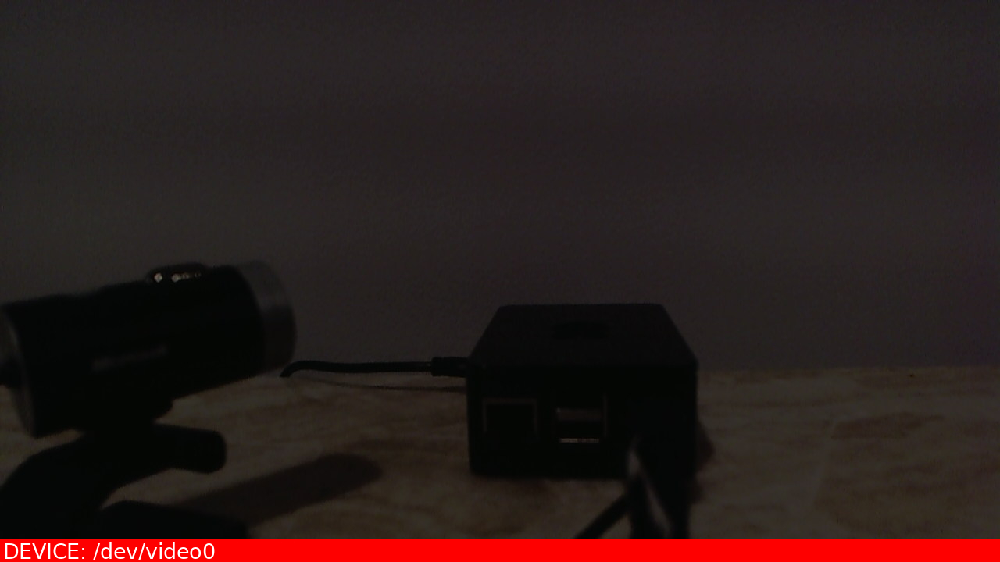
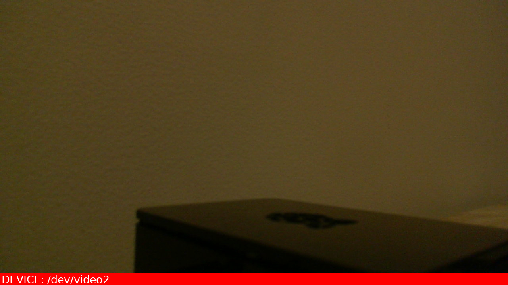

# Satellite :satellite:
A satellite-control program that reports system diagnostics and camera feeds
to a specified email address.

### Example
```
python3 main.py -p
```

### Email Received
#### Diagnostics
|                   |                       |
|-------------------|-----------------------|
| CPU Usage         |	12.0%               |
| Wifi Strength	    |   95.7%               |
| Temperature       |	119.0°F             |
| Memory Used	    |   6.4%                |
| Memory Available	|   806.2 MB            |
| System	        |   Linux               |
| Processor	        |   Unknown             |
| Boot Time	        |   01/21/2021 07:10 PM |

#### Attachments




## Usage
1. Modify [config.json](./static/config.json) in the [static folder](./static), specifying email account and server information.
2. Run [main.py](./main.py), with optional command line arguments if desired.

## Optional Arguments
Usage: main.py [-h] [-v] [-p] [-n] [-d DEVICE] [-l] [--diagnostics] [-o FILE]

| Parameter                 | Description                               |	
| :------------------------ | :---------------------------------------- |
| -h --help                 | show help message and exit                |
| -v --verbose              | show output when running the program      |
| -p --process-images       | add image processing to captured images   |
| -n --no-email             | don't email the images after capture      |
| -d DEVICE --device DEVICE | specify device to use for capturing photos (specify 'all' to use all devices) |
| -l --list-devices         | list all detected devices and quit        |
| --diagnostics             | list system diagnostics and quit          |
| -o FILE --output FILE     | output logs to the given file             |

## Requirements
- [fswebcam package](http://manpages.ubuntu.com/manpages/bionic/man1/fswebcam.1.html).
- Python package requirements are listed in [requirements.txt](./requirements.txt).


### Resources Used
- [Email Setup](https://realpython.com/python-send-email/)
- [fswebcam on Raspberry Pi](https://www.raspberrypi.org/documentation/usage/webcams/)
- [Raspberry Pi Camera Module](https://projects.raspberrypi.org/en/projects/getting-started-with-picamera)